# Software Requirements Specification for *LMS*

## 1.  Introduction

### 1.1  What’s *LMS*

LMS is a world-class online-learning management web application that makes it really easy for creators to build own online school.

### 1.2  Scope of *LMS*

LMS cannot produce any content about courses and it just helps instructors build own online course system.

## 2. Functional Requirements

### 2.1  Students Use Case

#### 2.1.1  Sign up

Students should be able to sign up LMS by entering their full name, email address, setting a password, and consenting to **LMS ’s Terms of Use and Privacy Policy** by checking the box.

#### 2.1.2   Login

Students should be able to sign up LMS by entering an **email address** and **password** to access courses.

#### 2.1.3   Log out

Students should be able to sign up LMS by clicking the **Log Out** button.

#### 2.1.4  Edit Profile

(1) Students should be able to edit full name by re-entering full name.

(2) Students should be able to edit the email address by re-entering an email address.

(3) Students should be able to change the password by re-entering password twice.

(4) Once students have finished edit profile, they should save their changes by clicking **save changes** button.

#### 2.1.5  Reset Password

(1)  If students forget own password, they should be able to send a request to reset their password by clicking **Forgot Password?** link, entering own email address into the **Email Address** field and then clicking **Send Me Instructions** button.

(2) Once students send a request, they should be able to reset the password by clicking **change my Password** button in the reset password email received in their email inbox. For security reasons, students will not receive any error message when the email address that they entered is not correct. 

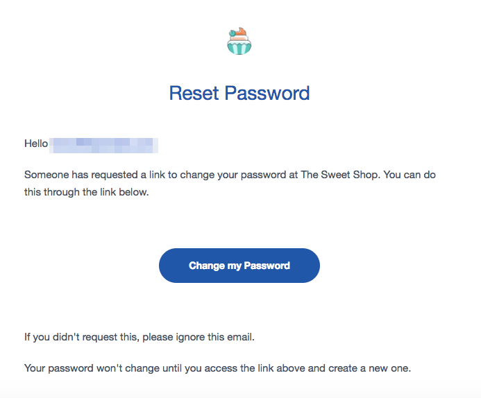

#### 2.1.6  Navigate and view course content

(1) when students have logged in the website, they should be directed to the course view. Course view is the 
place where all courses will be gathered and displayed as lists, and each individual course in the list is a card containing the basic information about the course, such as the course name, brief introduction and study period.

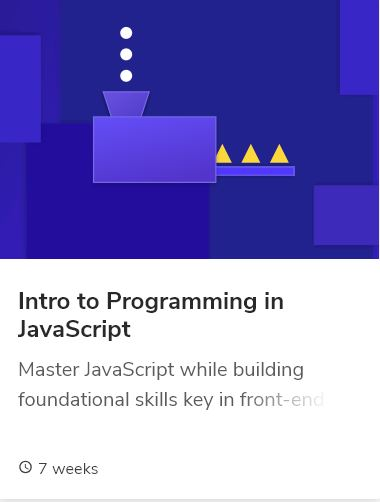

(2) Courses displayed on course view will be organized by categories so that students can browse courses by category through category navigation bar. 

(3) An individual course will have a landing page as an entry port. It should consist of two parts of content so that students could have a summary understanding of the course and then start learning.

- Overview

The first part is the overview of course that explains course objectives and what skills will the course deliver.

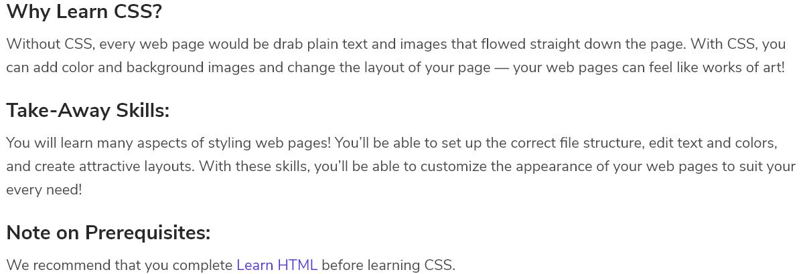

- Syllabus

The other part is syllabus, which shows an expandable list of where students can start learning.

(4) Once students have clicked the course that they would like to access, students should be directed to the course’s curriculum view.

(5)  In course curriculum view students should be able to view the following information

- Course Progress

This progress bar displays the percentage of the course that you have completed.

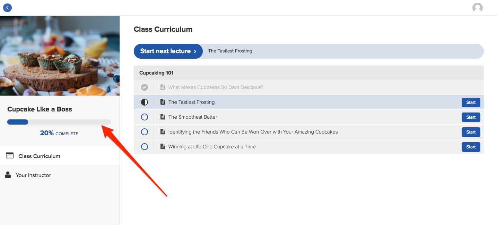

- Class Curriculum

This displays all of the sections and lectures in the course.

- Your Instructor

This provides descriptions of the instructor teaching the course.

(6)  Students should be able to view each individual lecture when they click the **Start** button.

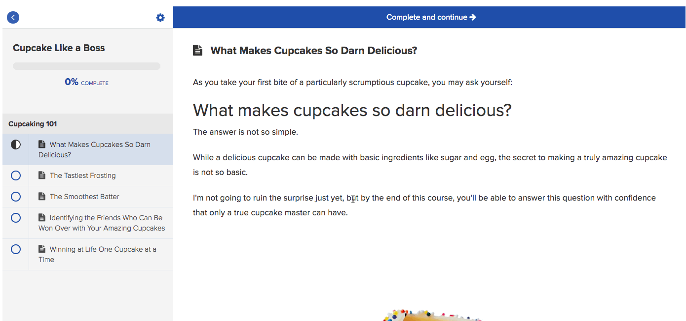

(7) Course presentation

- A course should be made by three types of content—videos, interactive practices, and quizzes(alternative).

1. Videos: The video is responsible for teaching students what they should have learned in the current section.

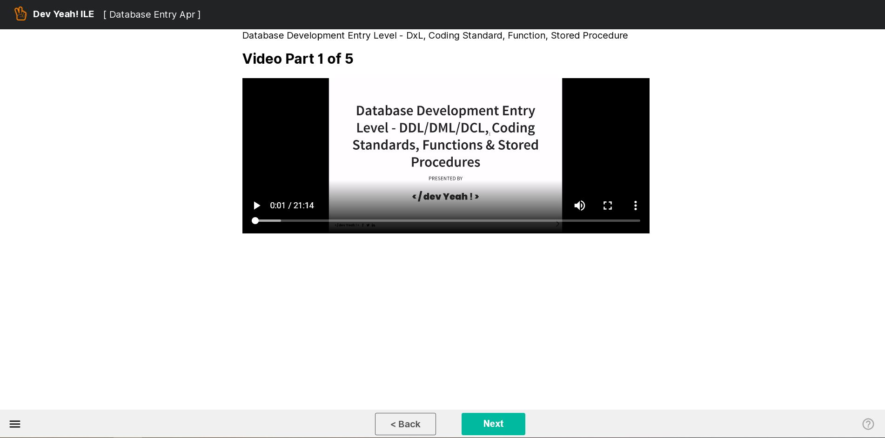

2. Interactive practices: By completing the tasks of the interactive practices, students can gain a better understanding of what they have learned from previous video lesson.

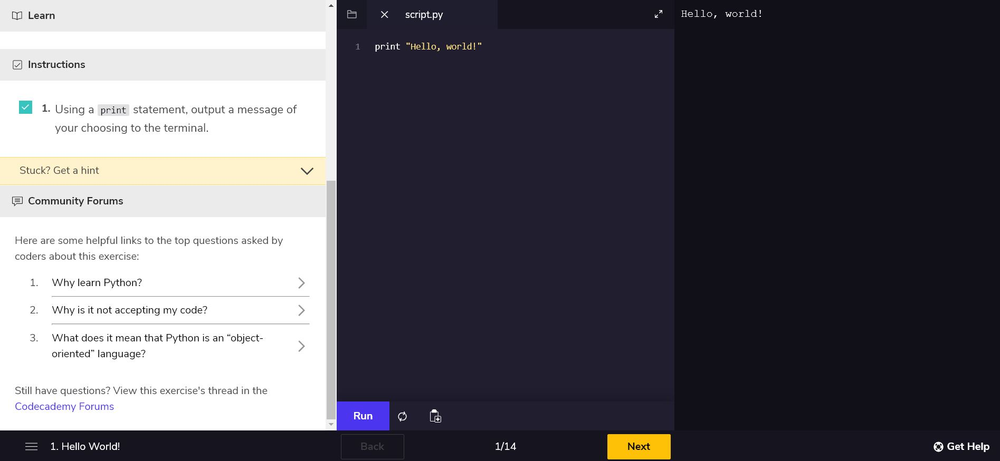

3. Quizzes(alternative): The quiz provides students with an opportunity to assess the outcome of the study.

(8)  If students don’t enroll in this course, they should be redirected to the course’s sales page when they clicked the course that they would like to access.

(9) If students don’t enroll in this course, they should be able to see **Lecture content locked** instead of real content when they click the **Start** button next to individual lecture on the sales page.

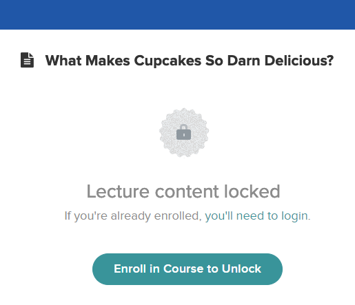

(10) Students should be redirected to the next uncompleted lecture in the course when they click **Start next lecture** button at the top of the course curriculum view.

(11) Students should be able to comment on individual lectures.

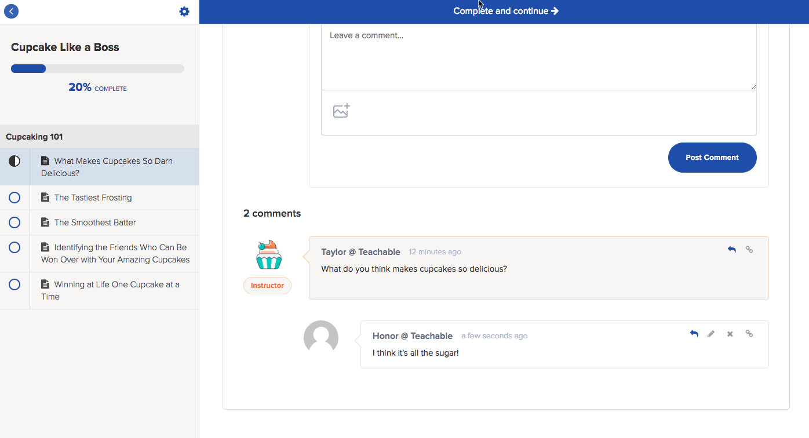

(12) Students should be able to go back to edit, delete own comment built before.

(13) Students should be able to use online quiz and get a score when they completed all quizzes.

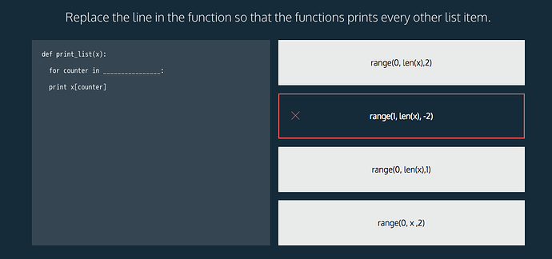

(14) Path

- Paths are in-depth structured journeys (composition of courses) that students can take 
at their own pace and get to their desired outcome.

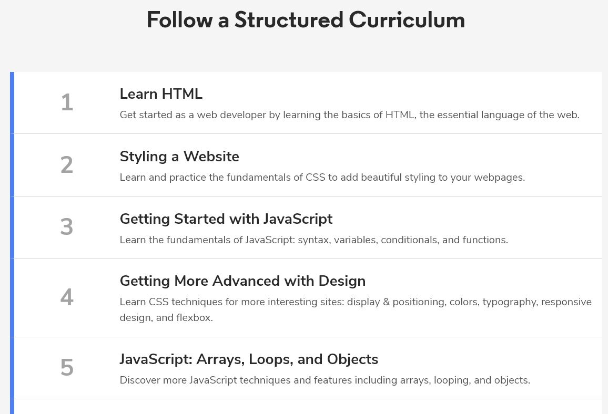